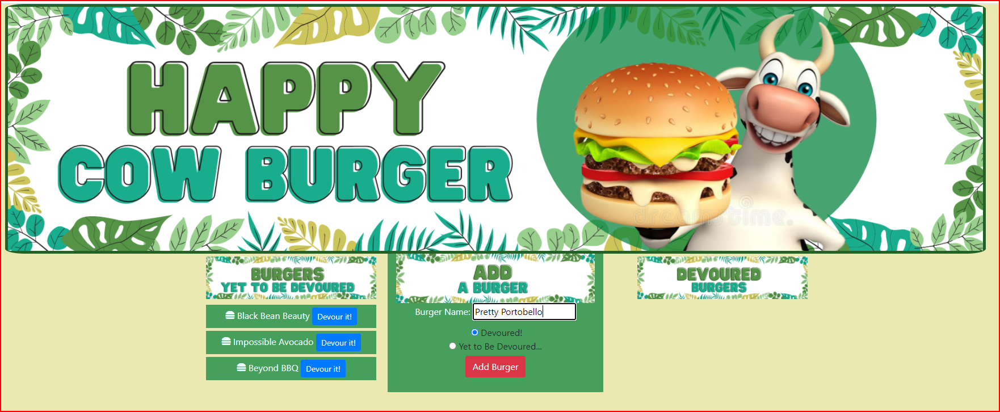

# Skye Lucking - Happy Cow Burger!
<h1>Technology Used</h1>
* MySQL  
* Node.js 
* Express 
* Handlebars 
* ORM 

<h1>Description of application</h1>
Happy Cow Burger! is a restaurant app that lets users input the names of burgers they'd like to eat. Whenever a user submits a burger's name, they can choose if the burger has been 'devoured 'or 'yet to be devoured'. Depending on their choice, the burger will appear on the left or right side of the screen. They can also switch between sides by choosing "Devour it!" or "Make again!".

The app will store every burger in a database, whether devoured or not.

 
 Enjoy!

 

<h1>Screenshots</h1>
App with a few burgers already in it... 
 

Add a burger name and decide if it is "Devoured" or "Yet to be Devoured"  

After you click "Add Burger" the burger will appear in appropriate column
 

You can move burgers between columns with the buttons
 

<h1>Link Heroku Deployed App</h1>
<a href="https://happy-cow-burger.herokuapp.com/">Ahttps://happy-cow-burger.herokuapp.com/</a>

<h1>Link to GitHub Repo</h1>
<a href="https://github.com/skyelucking/happy-cow-burger">https://github.com/skyelucking/happy-cow-burger</a>

<h1>Now here is your joke...</h1>  
Q: What do you call cattle that tell jokes?

 
 
 
<em>– A: Laughing stock./em>
